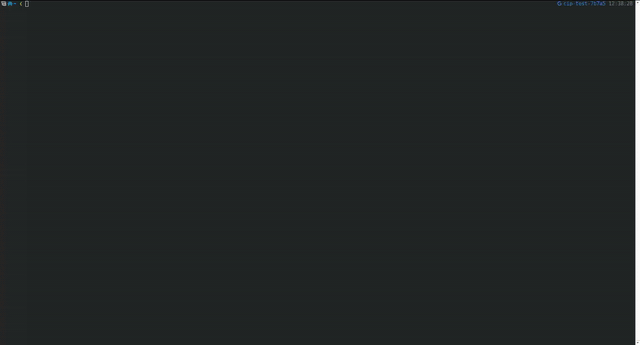

<p align="center">
  
</p>

<h1 align="center">cinex-cli</h1>

<p align="center">
  CLI y TUI no oficial para consultar cartelera, horarios, cines, trailers y posters de Cinex Venezuela.
</p>

<p align="center">
  
</p>

## Instalacion

Descarga el binario para tu sistema desde los [releases](https://github.com/italovisconti/cinex-cli/releases/latest).

### Linux

```bash
curl -sSL https://github.com/italovisconti/cinex-cli/releases/latest/download/cinex-linux-x64 -o cinex
chmod +x cinex
sudo mv cinex /usr/local/bin/
cinex
```

### macOS

Usa `cinex-macos-arm64` para Apple Silicon o `cinex-macos-x64` para Intel.

```bash
curl -sSL https://github.com/italovisconti/cinex-cli/releases/latest/download/cinex-macos-arm64 -o cinex
chmod +x cinex
sudo mv cinex /usr/local/bin/
cinex
```

### Windows

```powershell
Invoke-WebRequest -Uri "https://github.com/italovisconti/cinex-cli/releases/latest/download/cinex-windows-x64.exe" -OutFile "cinex.exe"
.\cinex.exe
```

Para ejecutarlo desde cualquier terminal, agrega la carpeta donde guardaste `cinex.exe` a `PATH`.

## Uso

Ejecuta `cinex` para abrir la TUI. `cinex tui` hace lo mismo de forma explícita.

| Tecla | Acción |
| --- | --- |
| `1`, `2`, `3`, `Tab`, `h`/`l`, `←`/`→` | Cambiar entre películas, cines y ciudades |
| `j`/`k`, `↑`/`↓` | Navegar o desplazar el detalle |
| `g` / `G` | Ir al inicio / final |
| `/` | Buscar en la vista actual; dentro de una película filtra sus cines |
| `Enter` | Abrir el detalle de la película o aplicar una ciudad |
| `p` | Ver el poster completo |
| `t` / `o` | Reproducir el trailer / abrirlo en el navegador, si está disponible |
| `r` | Recargar cartelera |
| `Esc` / `q` | Limpiar filtro, cerrar detalle o salir |

El detalle muestra un preview del poster sobre la sinopsis cuando hay espacio. Si no puede generarse, el layout se mantiene y `p` sigue disponible.

## CLI

| Comando | Ejemplo | Descripción |
| --- | --- | --- |
| `cartelera` | `cinex cartelera --city Caracas` | Lista películas; permite `--city` y `--genre`. |
| `show <película>` | `cinex show "La Odisea"` | Muestra sinopsis, horarios y poster. Usa `--no-poster` o `--open` si lo necesitas. |
| `trailer <película>` | `cinex trailer Spiderman --keep` | Reproduce el trailer. `--open` lo abre en el navegador. |
| `poster <película>` | `cinex poster "La Odisea" --width 50` | Muestra el poster; acepta `--open`. |
| `cines` | `cinex cines --city Caracas` | Lista los cines, opcionalmente por ciudad. |
| `cine <nombre>` | `cinex cine Tolón` | Muestra cartelera y horarios de un cine. |
| `ciudades` | `cinex ciudades` | Lista las ciudades disponibles. |
| `4dx` / `vip` | `cinex 4dx` | Filtra funciones en salas especiales. |
| `compartir <película> [cine]` | `cinex compartir Spiderman Tolón` | Genera un resumen para compartir. |

Durante la descarga o reproducción de un trailer, usa `Ctrl+C` para cancelarlo. Solo las películas con trailer muestran la opción correspondiente en la TUI.

## Opcionales

- [`yt-dlp`](https://github.com/yt-dlp/yt-dlp): descarga trailers para reproducirlos en la terminal. Sin él, la app abre el enlace en el navegador.
- `timg` o `mpv`: mejoran la reproducción de trailers y el poster completo, pero no son necesarios para usar la app ni para el preview inline.
- Una terminal con Unicode y TrueColor ofrece la mejor experiencia. El render ANSI funciona en terminales modernas, incluido Windows Terminal.
- Si tu fuente no incluye Nerd Fonts, usa `NO_NERD_FONTS=1 cinex` para iconos ASCII.

## Tema

El tema `cinex` es el predeterminado. Para usar la paleta clásica:

```bash
CINEX_THEME=classic cinex
```

También puedes guardar `{ "theme": "classic" }` en `~/.config/cinex-cli/config.json`.

## Desarrollo

Requiere [Bun](https://bun.sh).

```bash
git clone https://github.com/italovisconti/cinex-cli.git
cd cinex-cli
bun install
bun run tui
```

Para generar los binarios de Linux, macOS y Windows:

```bash
bun run release:build
```

## Licencia

[MIT License](LICENSE)
